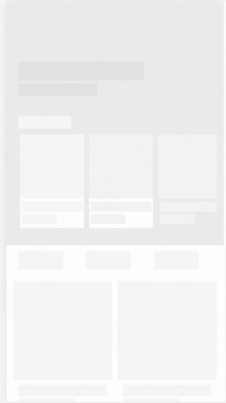

# sketch-skeleton
Generate skeleton screen from sketch

## motivation
Skeleton screens are often used in our web applications, but how to generate skeleton screens quickly and accurately is a problem.

Sketch is a commonly used UI design software. It is a good way to generate a skeleton screen through a sketch design draft.

## Preview


## Installation
 ```
 npm i sketch-skeleton -g
 ```

## Usage


### Use with cli 
```
skeleton build demo.sketch -d destDir
```

You can get [demo.sketch](./assets/demo.sketch) here.

If you don't set dest dir, the tool will use working-dir/sketch-file-name instead.

So you can view measure pages in destDir.

#### Options
skeleton build receives the following parameters：

- **-d, --dest \<dir\>** dest directory which html skeleton pages generate to.
- **-l, --useLoading \<useLoading\>** add loading in generated skeleton. (default: "true")
- **-a, --useAdaptive \<useAdaptive\>** generated skeleton page can be adaptive. (default: "true")
- **-m, --generateHtml \<generateHtml\>** generate html skeleton pages. (default: "true")
- **-t, --generateTemplate \<generateTemplate\>** generate template skeleton pages. (default: "true")
- **-v, --verbose** print details when execute commands.


### Use with function
You can use `getSketchString` to get the skeleton screen content。
#### **getSketchString(sketchFile, object[, options])**
parameter： 
- sketchFile \<String\> sketch file path
- options \<Object\> 
  - useLoading \<Boolean\> add loading in generated skeleton. (default: "true")
  - useAdaptive \<Boolean\> generated skeleton page can be adaptive. (default: "true")

retrun: \<String\> skeleton screen content  

### Example:
```js
const { getSketchString } = require('sketch-skeleton')

async function main() {
  const sketch = await getSketchString('demo.sketch')
  console.log('----sketch---:', sketch)
}
main()
```

## References
- [sketch-measure](https://github.com/utom/sketch-measure) to learn how sketch-measure works.
- [sketch-measure-cli](https://github.com/devsigners/sketch-measure-cli) to learn how transform sketch in node.
